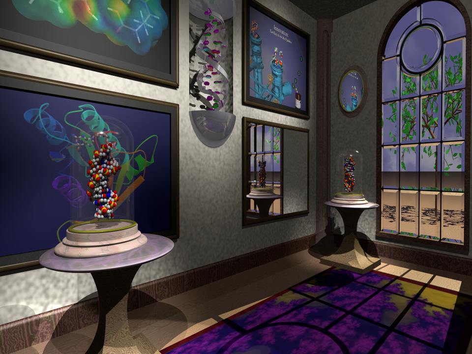

# Quiltwright

[](https://www.python.org/)
[](LICENSE)
[](https://pypi.org/project/quiltwright/)
[](https://github.com/suchanek/quiltwright/releases)
[](https://github.com/suchanek/quiltwright/actions/workflows/tests.yml)
[](https://doi.org/10.5281/zenodo.21798503)

**Holographic output for scientific visualisation.**

*Eric G. Suchanek, PhD — Flux-Frontiers*

Quiltwright is the last stage of two scientific rendering pipelines. It takes
scenes that already exist — geometric ML manifolds from
[WaveRider](https://github.com/Flux-Frontiers/waverider), molecular structures
from [pdb2pov](https://github.com/suchanek/pdb2pov) — and puts them on
holographic hardware, in glasses-free depth.



*A career in structural biophysics, arranged as exhibits: B-DNA and Z-DNA
under bell jars, Ras and a drug-discovery pipeline on the walls. The molecular
models were generated by pdb2pov in 1997; the room dates to 1995. Quiltwright
ray-traces it into a 48-view light-field quilt for Looking Glass light-field
panels, or into 2-D video for Hololuminescent displays. A third output — a
23-view sweep for LitiHolo's desktop hologram printer — is in development.*
[About the image →](docs/about-the-image.md)

---

## What it's for

```
     scene sources                  quiltwright                  outputs

  PyVista / VTK  ─────┐        ┌──────────────────┐        ┌──→  LFD  light-field panels
   (WaveRider, TVB)   │        │  off-axis views  │        │          multi-view quilts
                      ├───────→│  depth budget    │───────→┼──→  HLD  hololuminescent
  POV-Ray  ───────────┘        │  quilt assembly  │        │          2-D video
   (pdb2pov)                   │  view sweeps     │        └──→  LitiHolo  hogel sweeps
                               └──────────────────┘                       (in development)
```

**Two scene sources.** WaveRider's voxel and manifold visualiser builds
PyVista/VTK scenes in memory; `render_quilt()` sweeps them. pdb2pov turns PDB
files into POV-Ray molecular scenes on disk, some of them decades old;
`render_pov_quilt()` ray-traces them, appending a camera per view and modifying
nothing. The two backends meet at a shared, renderer-agnostic assembler. Scenes
need not come from either pipeline: `quiltwright.tvb_data` fetches real brain
geometry from [The Virtual Brain](docs/tvb-data.md), and PyVista's own example
datasets work as-is.

**Two display technologies**, which are easy to confuse because one company
sells both. *Light-field displays* (LFD — Portrait, Go, 16″/27″/32″/65″) are
lenticular panels that consume **quilts**: N views of the same scene tiled into
one image, fused optically into real depth. *Hololuminescent displays* (HLD —
16″/27″/86″) play **ordinary 2-D video** behind a fixed holographic optic, and
need styling rather than parallax — dark field, high contrast, generous safe
margins. `quiltwright.lfd` targets the first; `quiltwright.hld` the second.

The shared middle is what makes this a package rather than two scripts: quilt
geometry and device presets, the depth-budget arithmetic that decides whether a
scene will fuse before you spend an hour rendering it, filename conventions
Looking Glass software parses, video encoding, and direct Bridge control.

**A third output, under development.** That middle also serves consumers that
are not panels at all: `render_pov_views()` writes the sweep as separate frames,
and `sweep_spec()` / `LITIHOLO_SWEEP` give the single-row layout a hologram
printer's prime view count needs and a quilt grid cannot express — so one scene
feeds a light-field panel and a hologram printer without being rebuilt. Nothing
has been through a printer's software yet, so the claim is a sweep matching
LitiHolo's published specification rather than verified compatibility;
[docs/lfd.md](docs/lfd.md#view-sweeps--when-the-consumer-is-not-a-panel) records
what is still open.

### The part that is easy to get wrong

Each view must use an **off-axis (asymmetric-frustum) projection** — the camera
slides sideways while continuing to face the same direction, with the image
plane sheared back onto the original view axis.

The intuitive alternative is to swivel each camera to keep the subject centred.
That is "toe-in", and it introduces vertical parallax and keystone distortion,
so the display cannot fuse the views: you get ghosting instead of depth. It is
the single most common way light-field renders go wrong, and it produces output
that looks perfectly plausible in any individual frame. Quiltwright does the
off-axis projection correctly in both backends, and gives you the arithmetic to
know in advance whether a scene will fuse.

---

## Install

```bash
pip install quiltwright              # core: quilt geometry + Bridge control
pip install "quiltwright[viz]"       # + PyVista/VTK rendering backend
```

The POV-Ray backend needs a `povray` binary on `PATH` rather than a Python
package:

```bash
brew install povray                  # macOS
```

For the complete stack — renderers, ffmpeg, Looking Glass Bridge, pdb2pov —
see the [installation guide](docs/install.md).

---

## Quick start

### From a PyVista scene

```python
import pyvista as pv
from quiltwright import QUILT_PRESETS, render_quilt, save_quilt

p = pv.Plotter(off_screen=True)
p.add_mesh(pv.ParametricTorus())

spec = QUILT_PRESETS["portrait"]
save_quilt(render_quilt(p, spec), "torus", spec)   # -> torus_qs8x6a0.75.png
```

### From a POV-Ray scene

The scene file is never modified — each view wraps it with `#include` and
appends one camera.

```python
from quiltwright import QUILT_PRESETS, PovCamera, render_pov_quilt, save_quilt

camera = PovCamera(location=(15, 20, 6), look_at=(44, 19.2, 45.1), fov=53.13)
spec = QUILT_PRESETS["16-landscape"]
quilt = render_pov_quilt("pov-scenes/museum/museum.pov", spec, camera,
                         include_paths=["pov-scenes/myinclude", "pov-scenes"])
save_quilt(quilt, "museum", spec)
```

The museum scene above ships in [pov-scenes/](pov-scenes/), and
[scripts/render_museum_hologram.py](scripts/render_museum_hologram.py) renders
it end-to-end with a measured depth budget — the worked case study in
[docs/povray.md](docs/povray.md), and the scene itself in
[docs/about-the-image.md](docs/about-the-image.md).

Two more scene trees ship alongside it — the bell-jar DNA still lifes the
museum's pedestals were built from, and porin's β-barrel over water. What is in
each, and how to render them directly, is in
[pov-scenes/README.md](pov-scenes/README.md).

### Send it to the display

```python
from quiltwright import cast_quilt, pause_quilt, resume_quilt, stop_quilt

cast_quilt("museum_qs8x6a1.77778.png", spec)   # needs Looking Glass Bridge >= 2.2
```

Saved filenames carry the `_qs<cols>x<rows>a<aspect>` suffix that Looking Glass
Studio and Bridge parse, so playback settings are detected automatically.

### Send it to a hologram printer (in development)

A printer wants the views as **separate frames**, not tiled, and LitiHolo's
published input specification asks for 23 of them per hogel — a prime count, so
no `columns × rows` grid can express it. `LITIHOLO_SWEEP` is that single-row
spec, and the camera sweep behind it is the same off-axis geometry a quilt is
built from:

```python
from quiltwright import LITIHOLO_SWEEP, format_depth_budget, render_pov_views

print(format_depth_budget(LITIHOLO_SWEEP, camera, {"near": 31, "far": 96}))

paths = render_pov_views("pov-scenes/museum/museum.pov", LITIHOLO_SWEEP,
                         camera, "sweep/",
                         include_paths=["pov-scenes/myinclude", "pov-scenes"])
# -> sweep/view000.png … sweep/view022.png, view 0 leftmost
```

Print the budget first rather than after. 23 views over 45° is **2.05° between
adjacent views** against a Portrait quilt's 0.74° — about 2.75× coarser sampling,
so a sweep has *less* margin than a quilt, not more. The museum, framed as
above, reports ~43 px of adjacent-view disparity at that cone: far past the
~8 px ghosting threshold, and exactly the sort of thing worth learning before
the ray-tracer starts rather than after.

This path is POV-Ray only for now, and no file has been through the printer's
software: what it emits is a sweep matching the published specification, which
is a narrower claim than compatibility. The two open questions — whether a hogel
slicer expects off-axis frusta or a toe-in arc, and whether 2.05° is too coarse
— are written up in
[docs/lfd.md](docs/lfd.md#what-this-does-and-does-not-establish).

---

## The depth budget

Whether a hologram fuses comes down to **adjacent-view disparity**: how far a
feature moves between neighbouring views. Roughly 4–5 px is the practical
ceiling; past ~8 px, hard edges ghost.

```python
from quiltwright import QUILT_PRESETS, focal_distance_for_range, view_disparity

# Put the focal plane where near and far content are equally penalised.
focal = focal_distance_for_range(near=31, far=96)       # harmonic mean, not midpoint
view_disparity(QUILT_PRESETS["16-landscape"], fov=53.13,
               focal_distance=focal, depth=31)          # -> px between adjacent views
```

Those two depths are measured, not guessed —
[`scripts/measure_depth_range.py`](scripts/measure_depth_range.py) sweeps an
opaque plane along the view axis and reports where a scene's content actually
begins and ends.

Three results worth knowing before you frame a shot:

- Content **at** the focal plane has zero disparity — it is welded to the glass.
- The focal plane belongs at the **harmonic mean** of the depth range, not the
  midpoint. Disparity is asymmetric in depth, and near content is the expensive
  side.
- A **narrower field of view increases** disparity. Zooming in magnifies the
  scene and the parallax with it. The widely repeated "use ~14° FOV" advice is
  specific to object-centric scenes; applied to an interior it makes ghosting
  worse.

For interiors there is a fourth trap that no arithmetic will warn you about:
the camera sweep physically travels `focal_distance × tan(cone/2)` sideways,
and in a room that path can run through a wall. See
[docs/povray.md](docs/povray.md#3-sweep-clearance--the-constraint-peculiar-to-interiors).

---

## Supported devices

`QUILT_PRESETS` carries the official quilt settings for Portrait, Go, and the
16″/27″/32″/65″ panels in both orientations. The 16″ Gen3 Landscape entry is
verified against what Bridge reports for real hardware.

```python
from quiltwright import QUILT_PRESETS
QUILT_PRESETS["16-landscape"]      # 8x6 views, 7680x4320, aspect 1.7778
```

---

## Documentation

| Document | Contents |
|----------|----------|
| [docs/install.md](docs/install.md) | Installing the full stack: package extras, POV-Ray, ffmpeg, Bridge, pdb2pov |
| [docs/lfd.md](docs/lfd.md) | Light-field output, Bridge/Studio setup, device presets, the PyVista path, view sweeps for hologram printers |
| [docs/pyvista-datasets.md](docs/pyvista-datasets.md) | PyVista dataset ideas for holograms: topography, the Allen mouse brain atlas, other strong-depth candidates |
| [docs/tvb-data.md](docs/tvb-data.md) | Brain geometry from The Virtual Brain: cortical surfaces, connectomes, parcellations, downloaded on demand |
| [docs/povray.md](docs/povray.md) | The POV-Ray backend: off-axis camera derivation, depth budget, sweep clearance, a worked case study |
| [docs/pov-workflow.md](docs/pov-workflow.md) | The procedure: taking an archive scene from "won't parse" to a quilt that fuses, step by step |
| [docs/pdb2pov.md](docs/pdb2pov.md) | Rendering molecular structures from PDB files as holograms |
| [docs/hld.md](docs/hld.md) | Hololuminescent Displays, which play ordinary 2-D video rather than quilts |
| [docs/about-the-image.md](docs/about-the-image.md) | The museum scene: what is on display, and the thirty-year pipeline behind it |
| [docs/gallery.md](docs/gallery.md) | The reference stills every quilt is swept from, one per scene, and how to regenerate them |

---

## Testing

```bash
pip install -e ".[viz]" && pip install pytest
pytest
```

Rendering tests skip cleanly on machines with no OpenGL stack, and the POV-Ray
tests skip when no `povray` binary is present. Under a headless CI runner, use
`xvfb-run -a pytest` to exercise them.

---

## The pipelines this serves

- [WaveRider](https://github.com/Flux-Frontiers/waverider) — manifold-aware
  geometric ML. Its voxel and manifold visualiser builds the PyVista scenes
  that `render_quilt()` sweeps.
- [pdb2pov](https://github.com/suchanek/pdb2pov) — PDB to POV-Ray converter,
  written in C in 1993 and still building from a fresh clone. It produced the
  molecular models in the image above, and still feeds the POV-Ray backend.
- [proteusPy](https://github.com/suchanek/proteusPy) — protein disulfide bond
  analysis and rendering.

## Citation

If you use Quiltwright in your work, please cite it. Citation metadata is in
[CITATION.cff](CITATION.cff); GitHub's "Cite this repository" button generates
BibTeX/APA from it, and the DOI badge above resolves to the archived release
on Zenodo.

```bibtex
@software{suchanek_quiltwright,
  author  = {Suchanek, Eric G.},
  title   = {Quiltwright: Holographic Output for Looking Glass Displays},
  url     = {https://github.com/suchanek/quiltwright},
  doi     = {10.5281/zenodo.21798503},
  version = {0.3.1},
  year    = {2026}
}
```

## License

BSD 3-Clause. See [LICENSE](LICENSE).
