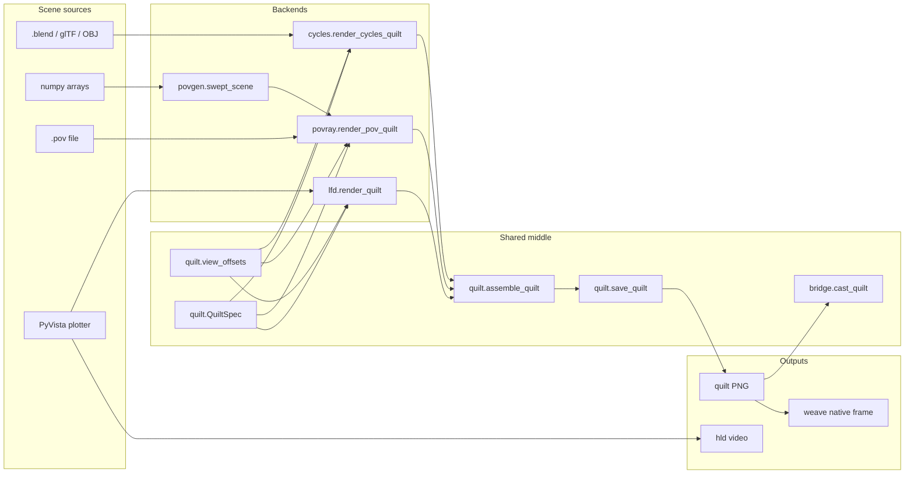

# Quiltwright module split

**Eric G. Suchanek, PhD** -- 29 August 2026
**Status:** PRs 1-3 landed on `develop`. PR 4 is option B (CLI stays
hardware and tooling; `scripts/` is the gallery). PR 5 leaves `tvb_data`
in the default public API.

The shared middle of this package -- quilt geometry, view offsets, assembly,
saving, Bridge control -- used to live inside `quiltwright.lfd`, the
PyVista backend. Three backends and the CLI imported those pieces from
there, including two private names. This plan moved that middle into modules
that match how the code is used, without breaking the public import graph.

It does not add a renderer, a display, or a CLI command. It makes the
architecture the README already describes into modules.

Companion: the fleet layering note in
`~/repos/kgrag_priv/docs/VISUALIZATION_STACK.md` (stale as of this writing:
it still says two renderers and PyPI 0.6.0; this package is 0.10.0 with a
Cycles backend). Refresh that file in `kgrag_priv`, not here.

---

## Overview

Quiltwright is layer 2 of the visualization stack: a scene in, a light-field
quilt (or HLD video) out. Three backends already converge on one assembler:

```
scene sources                 backends                    shared middle                 outputs
PyVista plotter  ----+                                    QuiltSpec / presets
POV-Ray .pov     ----+--->  off-axis views  ------------> assemble_quilt  -----------> LFD quilts
Blender / mesh   ----+      depth budget                  save / cast                  HLD video
arrays (povgen)  ----+                                    view_offsets                 weave (no Bridge)
PyMOL cartoons   ----+                                                                 LitiHolo sweep
TVB brains       ----+
```

Today the "shared middle" column is functions in `src/quiltwright/lfd.py`.
`povray.py` and `cycles.py` import `QuiltSpec`, `assemble_quilt`, and
`view_offsets` from the PyVista module. `cycles.py` also imports the private
`_camera_frame`. `cli/cmd_cast.py` imports `_bridge_post` and
`_enter_orchestration`. `lfd.depth_report` imports `PovCamera` from
`povray` to format a report, which is the cycle the comment at
`lfd.py:552` already apologizes for.

The proposed shape:

```
quiltwright.quilt    QuiltSpec, presets, assemble, view math, save     numpy + pillow
quiltwright.bridge   HTTP client, cast / pause / resume / stop         stdlib
quiltwright.lfd      PyVista render_quilt, scene_depths, quilt video   [viz]
quiltwright.povray   POV-Ray backend; Clearance stays here             povray binary
quiltwright.cycles   Cycles backend                                    blender binary
```

`from quiltwright.lfd import QuiltSpec` continues to work in the same
release: `lfd` re-exports every name that moved. Fleet consumers that import
from `quiltwright` or `quiltwright.lfd` do not change.

---

## Background

PyCodeKG on package source (rebuilt 2026-08-29, tests and scripts excluded):

| Module | Lines | SIR rank | What it actually is |
|---|---|---|---|
| `povgen.py` | 1686 | 1 | SDL composer; no VTK. Leave it. |
| `lfd.py` | 1130 | 2 | Quilt geometry **and** PyVista **and** Bridge **and** video |
| `povray.py` | 1103 | 3 | POV-Ray backend **and** POV depth-budget arithmetic |
| `tvb_data.py` | 842 | 4 | TVB dataset downloader |
| `cycles.py` | 1420 | 5 | Blender backend (0.9.0) |
| `hld.py` / `weave.py` | 364 / 313 | 9 / 7 | Isolated. Each takes one name from `lfd`. |

The graph is acyclic. Docstring coverage on package source is 94%. There are
no god functions. The problem is the module boundary, not complexity inside
a function.

Off-axis projection -- the load-bearing invariant -- is three independent
translations of the same formula, with comments claiming they match and no
algebraic test:

| Backend | Function | What it mutates |
|---|---|---|
| VTK | `lfd._apply_off_axis_view` | `SetWindowCenter(-offset / half_width, 0)` |
| POV-Ray | `povray.camera_block` | shears `direction` by `offset * D / Z` |
| Cycles | `cycles.view_shift_x` | `-offset / (2 * Z * tan(fov/2) * aspect)` |

`PovCamera` and `CyclesCamera` are the same dataclass up to handedness
(POV-Ray left-handed, Blender/VTK right-handed). `CyclesCamera`'s docstring
already says `povray.depth_budget` accepts either camera.

The CLI covers `mesh`, `cartoon`, `probe`, `cast`, `weave`, `wallpaper`,
`bridge`. POV-Ray scenes, PyVista scenes, `.blend` files, and HLD video
still go through `scripts/render_*.py`. PR #36 promoted cartoon / mesh /
probe; museum, vitrine, still-life, and the PyVista demo did not follow.

---

## Goals and non-goals

**Goals**

1. A numpy-only quilt core that `povgen` can import without touching VTK.
2. A stdlib Bridge client that the CLI can import without touching VTK.
3. One `QuiltCamera` protocol and one algebraic off-axis identity test
   across the three backends.
4. Depth-budget *arithmetic* (`view_disparity`, `focal_distance_for_range`,
   `sweep_extent`) next to `QuiltSpec`. Scene *measurement* stays in the
   backend that can see the scene.
5. Private cross-module imports go away (`_camera_frame`, `_bridge_post`,
   `_enter_orchestration`, `COURTESY_CORES_HELD_BACK`).

**Non-goals**

- Splitting `povgen.py` because it is long. The `Primitive` hierarchy is
  cohesive.
- Splitting `tests/test_lfd.py` / `test_povgen.py` / `test_cycles.py`.
  Those files are the spec.
- A `Backend` ABC. Three functions that return an `ndarray` and call
  `assemble_quilt` do not need a class hierarchy.
- Breaking `from quiltwright.lfd import QuiltSpec` in this release.
- Shrinking `__all__`.
- A `ViewSweep` type, or LitiHolo work, until a printer verifies
  `LITIHOLO_SWEEP`.
- Changing HLD or weave except for import-path updates.
- Promoting `scripts/render_museum_hologram.py` into a subcommand.
- Editing `kgrag_priv` from this repo's PRs.

---

## Proposed design



### Target modules after PR 1

| Module | Owns | Dependencies |
|---|---|---|
| `quiltwright.quilt` | `QuiltSpec`, `QUILT_PRESETS`, `sweep_spec`, `LITIHOLO_SWEEP`, `view_offsets`, `view_disparity`, `focal_distance_for_range`, `assemble_quilt`, `save_quilt` | numpy, pillow |
| `quiltwright.bridge` | `BRIDGE_URL`, `cast_quilt`, `save_and_cast_quilt`, `pause_quilt`, `resume_quilt`, `stop_quilt`, and the PUT helper the CLI currently borrows | stdlib |
| `quiltwright.lfd` | `render_quilt`, `render_quilt_video`, `find_ffmpeg`, `scene_depths`, `frame_and_focus`, `depth_report`, `_apply_off_axis_view`, plus re-exports of everything that moved | `[viz]` for render; re-exports need only numpy |
| `quiltwright.povray` | `PovCamera`, `camera_block`, `render_pov_quilt`, `Clearance`, `depth_sweep` | quilt + povray binary |
| `quiltwright.cycles` | `CyclesCamera`, `view_shift_x`, `render_cycles_quilt` | quilt + blender binary |

`find_ffmpeg` stays in `lfd` for PR 1 (`hld` and `render_quilt_video` both
call it). Moving it is a one-line follow-up if a fourth caller appears.

### Compatibility shim

`lfd.py` re-exports every moved name:

```python
from quiltwright.quilt import (
    LITIHOLO_SWEEP,
    QUILT_PRESETS,
    QuiltSpec,
    assemble_quilt,
    focal_distance_for_range,
    save_quilt,
    sweep_spec,
    view_disparity,
    view_offsets,
)
from quiltwright.bridge import (
    BRIDGE_URL,
    cast_quilt,
    pause_quilt,
    resume_quilt,
    save_and_cast_quilt,
    stop_quilt,
)
```

Identity is part of the contract: `quiltwright.lfd.QuiltSpec is
quiltwright.quilt.QuiltSpec`. A test pins that, so the shim cannot drift
into a copy.

`src/quiltwright/__init__.py` `_LAZY` retargets the moved names at their
new homes. That is the one functional improvement in PR 1:
`from quiltwright import QuiltSpec` currently imports `lfd`, which tries
`import pyvista` at module scope. After the retarget, a core install
loads numpy and pillow only.

Existing `from quiltwright.lfd import QuiltSpec` still works via the shim.

### What moves in PR 1, by line

From `src/quiltwright/lfd.py` today:

| Lines | Symbol | New home |
|---|---|---|
| 81--207 | `QuiltSpec` | `quilt.py` |
| 210--233 | `QUILT_PRESETS` | `quilt.py` |
| 236--275 | `sweep_spec`, `LITIHOLO_SWEEP` | `quilt.py` |
| 283--362 | `view_offsets`, `view_disparity`, `focal_distance_for_range` | `quilt.py` |
| 617--653, 747--777 | `assemble_quilt`, `_resize_view`, `save_quilt` | `quilt.py` |
| 919--1130 | Bridge HTTP, `cast_quilt`, transport control | `bridge.py` |

Stays in `lfd.py`: `_require_pyvista`, `frame_and_focus`, `DEPTH_LABELS`,
`scene_depths`, `depth_report`, `_camera_frame`, `_apply_off_axis_view`,
`render_quilt`, `find_ffmpeg`, `_encode_args`, `render_quilt_video`.

Internal callers switch to the new homes in the same PR:

- `povray.py`: `QuiltSpec`, `assemble_quilt`, `view_disparity`,
  `view_offsets` from `quiltwright.quilt`
- `cycles.py`: `QuiltSpec`, `assemble_quilt` from `quiltwright.quilt`;
  `_camera_frame` stays on `lfd` until PR 2
- `weave.py`, `cli/options.py`, `cli/cmd_weave.py`, `cli/cmd_mesh.py`:
  `QuiltSpec` / `QUILT_PRESETS` / `save_quilt` from `quiltwright.quilt`
- `cli/cmd_cast.py`, `cli/cmd_bridge.py`, `cli/cmd_mesh.py`: Bridge names
  from `quiltwright.bridge`
- Tests keep importing from `quiltwright.lfd` so the shim stays honest.
  New tests cover identity and "importing `quiltwright.quilt` does not
  import pyvista".

Scripts under `scripts/` can keep importing from `lfd` for PR 1. They are
not the public API and updating them is noise in a split PR.

### PR 2 -- camera protocol and off-axis identity

Do **not** unify the three emit functions. VTK, POV-Ray, and Blender take
different numbers. Share the frame and the dimensionless shear.

```python
class QuiltCamera(Protocol):
    location: tuple[float, float, float]
    look_at: tuple[float, float, float]
    fov: float

    @property
    def focal_distance(self) -> float: ...
    def basis(self) -> tuple[np.ndarray, np.ndarray, np.ndarray]:
        """(forward, right, up) unit vectors in that camera's handedness."""
```

`PovCamera` and `CyclesCamera` already have `location`, `look_at`, `fov`,
`focal_distance`, and `basis()`. Handedness is the real difference:
`PovCamera.basis` is left-handed (`right = up x forward`); `CyclesCamera.basis`
is right-handed (`right = forward x up`). The protocol does not hide that.

One numpy-only helper next to `view_offsets`:

```python
def window_shear(offset: float, focal_distance: float, fov: float, aspect: float) -> float:
    """Dimensionless horizontal window shift that pins the look-at point.

    VTK WindowCenter is this value (half-widths). Blender shift_x is
    this value divided by 2 (fractions of frame width). POV-Ray shears
    ``direction`` by ``offset * D / Z``, which is the same geometry
    expressed in image-plane units.
    """
    return -offset / (focal_distance * math.tan(math.radians(fov) / 2.0) * aspect)
```

Each backend converts units. The test that earns this PR is algebraic, not
a 48-view render:

1. Same `location`, `look_at`, `fov`, `aspect`, `offset`.
2. VTK `WindowCenter[0] == window_shear(...)`.
3. `view_shift_x(...) == window_shear(...) / 2`.
4. The POV-Ray `direction` shear `offset * D / Z` reconstructed from
   `camera_block` matches the same look-at pin (existing
   `test_povray.py` already checks the pin; extend it to compare against
   `window_shear`).

Promote `lfd._camera_frame` to public `camera_frame` on `lfd` (it is a
vtkCamera decomposition, so it stays in the PyVista module). `cycles.py`
imports the public name.

Move `COURTESY_CORES_HELD_BACK` out of `povray.py` into a tiny
`quiltwright.runtime` (or onto `quiltwright.quilt` if you refuse a
one-constant module). `cycles.py` and `povray.py` both read it.
`runreport.py` already imports `resolve_work_threads` from `povray`;
that stays.

### PR 3 -- depth-budget arithmetic next to QuiltSpec

Move from `povray.py` into `quilt.py`:

- `sweep_extent(spec, focal_distance)` -- closed form of the outermost
  `view_offsets` magnitude; no POV-Ray types.

Leave in `povray.py`:

- `Clearance` -- measured corridor of an interior `.pov`
- `depth_sweep` / `summarise_depth_sweep` -- probe renders
- `depth_budget` / `format_depth_budget` -- take a `QuiltCamera` (or
  anything with `fov` and `focal_distance`), not a `PovCamera`

Leave in `lfd.py`:

- `scene_depths`, `frame_and_focus` -- they read a `pv.Plotter`
- `depth_report` -- stop constructing a throwaway `PovCamera`. Call
  `format_depth_budget(spec, frame, depths)` with a duck-typed frame
  built from `_camera_frame`. That deletes the lazy import of `povray`
  at `lfd.py:554` and the cycle it exists to break.

`format_depth_budget` already only needs `camera.fov` and
`camera.focal_distance`. After PR 2 that is `QuiltCamera` (or anything
with those two attributes).

### PR 4 -- CLI versus scripts (decided: option B)

CLI stays hardware and tooling (`cast`, `weave`, `wallpaper`, `bridge`)
plus three commands that take arbitrary input (`mesh`, `cartoon`,
`probe`). `scripts/` is the gallery of composed exhibits. There is no
generic `quiltwright render`. The museum does not become a subcommand.
Documented in [shell.md](shell.md) and the README.

### PR 5 -- `tvb_data` (decided: leave it)

`tvb_data` stays in the default public API. Loading is NumPy only; the
GPL-3.0 archive is fetched at runtime and never vendored. Documented in
[tvb-data.md](tvb-data.md). `pymol.py` stays as a scene source for the
same reason -- see [pdb2pov.md](pdb2pov.md).

---

## API and interface changes

Public names do not disappear. Import *paths* gain two modules.

| Name | Today | After PR 1 | `lfd` re-export |
|---|---|---|---|
| `QuiltSpec`, `QUILT_PRESETS`, `assemble_quilt`, `save_quilt`, `view_offsets`, `view_disparity`, `focal_distance_for_range`, `sweep_spec`, `LITIHOLO_SWEEP` | `quiltwright.lfd` | `quiltwright.quilt` | yes |
| `cast_quilt`, `save_and_cast_quilt`, `pause_quilt`, `resume_quilt`, `stop_quilt`, `BRIDGE_URL` | `quiltwright.lfd` | `quiltwright.bridge` | yes |
| `render_quilt`, `render_quilt_video`, `depth_report`, `scene_depths`, `frame_and_focus`, `find_ffmpeg` | `quiltwright.lfd` | `quiltwright.lfd` | n/a |

`from quiltwright import QuiltSpec` keeps working. `_LAZY` points at
`quilt` instead of `lfd`.

No data-model change. No on-disk format change. Quilt filenames, Bridge
payloads, and POV-Ray wrappers are untouched.

---

## Alternatives considered

**Rename `lfd.py` to `pyvista.py` and leave geometry in it.** The name
would match the backend, but every other backend would still import
quilt geometry from the PyVista module. That is the bug. Rejected.

**A `quiltwright.core` package with submodules.** Too much tree for
~400 lines of geometry and ~200 lines of HTTP. Two modules beside
`lfd.py` are enough. Rejected for PR 1; revisit only if a third
shared concern appears.

**Unify `PovCamera` and `CyclesCamera` into one dataclass with a
handedness flag.** The emit functions still have to branch, and a
wrong-handed `basis()` is a silent ghosting bug. A `Protocol` plus two
concrete cameras is the smaller lie. Rejected as a merge; accepted as
a protocol in PR 2.

**A `Backend` ABC with `render_views(spec, camera)`.** Three call
sites, three renderer-specific kwargs (`antialias` / `samples` /
`zoom`). An ABC would freeze the wrong shape. A shared `RenderJob`
(progress, `keep_views`, threads) is the only kwargs-drift fix worth
doing, and it is optional follow-up, not a PR in this plan.

**Split `povgen.py` into primitives vs composition.** No second
composer exists. Line count is not a boundary. Rejected.

---

## Risks

| Risk | Severity | Mitigation |
|---|---|---|
| Fleet consumers import `quiltwright.lfd.QuiltSpec` and break if the shim is a copy | High | Identity test; re-export the objects, do not wrap them |
| `_LAZY` retarget loads a different module and a test that patches `quiltwright.lfd.save_quilt` silently misses | Medium | Keep tests importing from `lfd` for names they already import; add a dedicated identity test |
| Circular import: `bridge` -> `quilt.save_quilt`, `lfd` -> both | Low | `quilt` imports nothing from this package. `bridge` imports `quilt`. `lfd` imports both. One direction. |
| `depth_report` still importing `povray` after PR 1 | Low | Accepted until PR 3. The lazy import stays until `format_depth_budget` takes a `CameraFrame` |
| Skipping PyVista / POV-Ray / Blender tests on machines without the binary | Existing | PR 1's new tests are numpy-only and must run everywhere |

Rollback is `git revert` of one PR. No feature flag: the shim makes the
split invisible to callers.

---

## Observability and security

No new logging, metrics, or network surface. Bridge remains HTTP to
`localhost:33334` over PUT, as [docs/lfd.md](lfd.md) already documents.
The split must not change the verb; Bridge answers POST with `200 OK`
and an empty body.

---

## Testing

PR 1, always, no extras required:

```bash
.venv/bin/pytest tests/test_lfd.py tests/test_weave.py tests/test_cli.py -q
```

Plus the new identity / no-VTK-on-core-import tests.

PR 1, with the viz extra (this machine has it):

```bash
.venv/bin/pytest tests/test_lfd.py tests/test_povray.py tests/test_cycles.py tests/test_hld.py -q
```

Render tests continue to skip when `povray` / `blender` / a display are
missing. Do not gate the split on a 48-view render.

PR 2 adds a numpy-only off-axis identity test. PR 3 extends
`tests/test_povray.py` depth-budget cases to a `CyclesCamera` as well as
a `PovCamera`.

---

## Open questions

Resolved.

1. **CLI versus scripts.** Option B. The CLI is hardware and tooling
   (`cast`, `weave`, `wallpaper`, `bridge`) plus three commands that take
   arbitrary input (`mesh`, `cartoon`, `probe`). `scripts/` is the gallery
   of composed exhibits. There is no generic `quiltwright render`. The
   museum stays a script.
2. **`tvb_data`.** Leave it. Loading is NumPy only; the GPL-3.0 archive is
   fetched at runtime and never vendored. An extra would tax the one
   consumer that already imports it, and dropping it from `__all__` is a
   break for no packaging gain.

---

## Key decisions

1. **Split `lfd.py`; do not rename it.** The PyVista backend is a real
   thing and should keep its name. The geometry and the HTTP client are
   what were in the wrong file.
2. **Two new modules, not a `core` package.** Quilt geometry and Bridge
   HTTP have different dependencies and different callers. A package
   around them is ceremony.
3. **Re-export from `lfd` for one release.** Breaking
   `from quiltwright.lfd import QuiltSpec` would tax every fleet
   consumer for a rename. Retarget `_LAZY` so *new* imports get the
   light module; leave the old path as an alias.
4. **Do not unify the three off-axis emitters.** Share the frame and
   the shear; convert units at the boundary. A wrong-handed merge ghosts.
5. **Do not split `povgen` or the large test files.** Cohesion, not
   line count.
6. **CLI is hardware and tooling; `scripts/` is the gallery.**
   `mesh` / `cartoon` / `probe` already cover arbitrary input. A composed
   exhibit (museum, vitrine) is not a subcommand.
7. **`tvb_data` stays in the default public API.** Scene source, NumPy
   loader, GPL data fetched at runtime. Not an extra.

---

## PR Plan

### PR 1 -- Extract `quilt` and `bridge` from `lfd`

- **Title:** `refactor: extract quilt geometry and Bridge client from lfd`
- **Depends on:** nothing
- **Files:** new `src/quiltwright/quilt.py`, `src/quiltwright/bridge.py`;
  thin `lfd.py`; retarget `_LAZY` in `__init__.py`; switch internal
  imports in `povray.py`, `cycles.py`, `weave.py`, `hld.py` (unchanged:
  still `find_ffmpeg` from `lfd`), `cli/options.py`, `cli/cmd_*.py`;
  new tests for object identity and core-import weight
- **Verify:** `.venv/bin/pytest tests/test_lfd.py tests/test_weave.py tests/test_cli.py tests/test_povray.py tests/test_cycles.py tests/test_hld.py -q`
- **Docs:** this file; one sentence in [lfd.md](lfd.md) that `QuiltSpec`
  lives in `quiltwright.quilt` and is re-exported. README documentation
  table gains this page.

### PR 2 -- Camera protocol and off-axis identity

- **Title:** `feat: QuiltCamera protocol and shared window-shear`
- **Depends on:** PR 1
- **Files:** `quilt.py` (`window_shear`); `povray.py` / `cycles.py` /
  `lfd.py` consume it; promote `camera_frame`; move
  `COURTESY_CORES_HELD_BACK`; new numpy-only test
- **Verify:** existing camera / shear tests plus the identity test, no
  renderer required

### PR 3 -- Depth-budget arithmetic in `quilt`

- **Title:** `refactor: move sweep_extent and QuiltCamera depth budget into quilt`
- **Depends on:** PR 2 (needs `QuiltCamera`)
- **Files:** `sweep_extent` -> `quilt.py`; `format_depth_budget` takes
  `QuiltCamera`; `lfd.depth_report` drops the `PovCamera` import
- **Verify:** `tests/test_povray.py` depth-budget cases, `tests/test_lfd.py`
  `TestSceneDepths` / `depth_report`

### PR 4 -- CLI versus scripts (option B)

- **Title:** `docs: CLI is hardware and tooling; scripts/ is the gallery`
- **Depends on:** nothing
- **Files:** [docs/shell.md](shell.md), README shell section, CLI group
  docstring, this plan

### PR 5 -- `tvb_data` stays

- **Title:** folded into PR 4
- **Decision:** leave in `__all__`. Documented in [tvb-data.md](tvb-data.md).

Follow-up outside this repo: refresh
`kgrag_priv/docs/VISUALIZATION_STACK.md` for three backends and
`quiltwright.quilt`.

---

## References

- [docs/lfd.md](lfd.md) -- quilt format, Bridge, PyVista path
- [docs/povray.md](povray.md) -- off-axis derivation, depth budget, clearance
- [docs/cycles.md](cycles.md) -- Blender shift, one process per sweep
- [docs/povgen.md](povgen.md) -- array-to-SDL composer
- [docs/hld.md](hld.md) / [docs/shell.md](shell.md) -- HLD video; CLI
- `src/quiltwright/__init__.py` -- PEP 562 lazy re-exports
- `src/quiltwright/quilt.py` -- QuiltSpec, window_shear, QuiltCamera, sweep_extent
- `src/quiltwright/bridge.py` -- cast_quilt and transport control
- `src/quiltwright/lfd.py` -- PyVista backend; re-exports quilt and bridge names
- `src/quiltwright/runtime.py` -- COURTESY_CORES_HELD_BACK
- `~/repos/kgrag_priv/docs/VISUALIZATION_STACK.md` -- fleet layering (stale:
  still says two renderers / 0.6.0; refresh outside this repo)
