# Gallery

The reference stills every quilt is swept from — one full-quality render per
scene, checked into [`renders/stills/`](../renders/stills/) as the diffable
record of what each scene looks like (`renders/quilts/` is the same scenes as
Looking Glass quilts, but those are 25–40 MB release assets, not repo
content — see [renders/README.md](../renders/README.md)).

Regenerate any of these with `make still-<name>` (`make help` lists them all),
or all at once with `make stills`.

---

## Museum

`pov-scenes/museum/` — "Eric's Science Museum," 1995–99. The room the README's
hologram is rendered from; what's on the walls is catalogued in
[about-the-image.md](about-the-image.md).

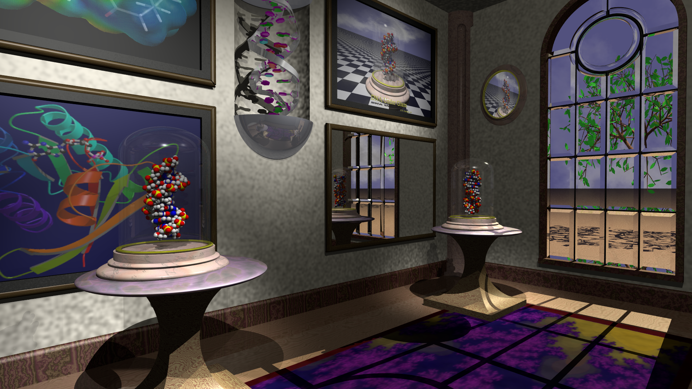

*`museum.pov` — the canonical cut, and the one
[`render_museum_hologram.py`](../scripts/render_museum_hologram.py) drives.*

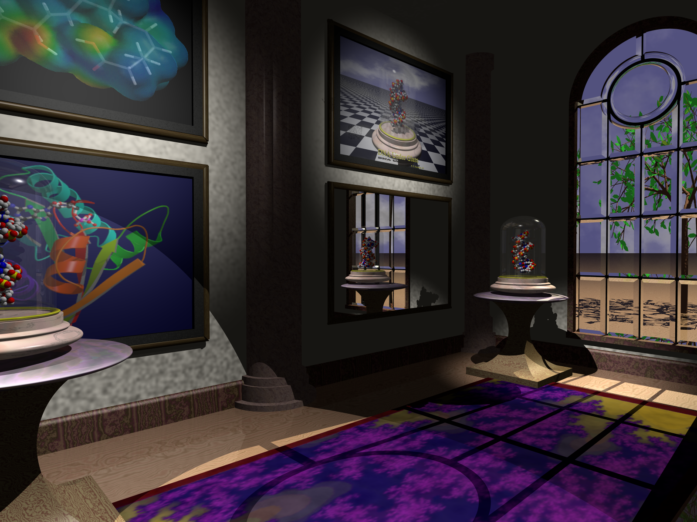

*`museum_dark.pov` — same room, interior lighting only.*

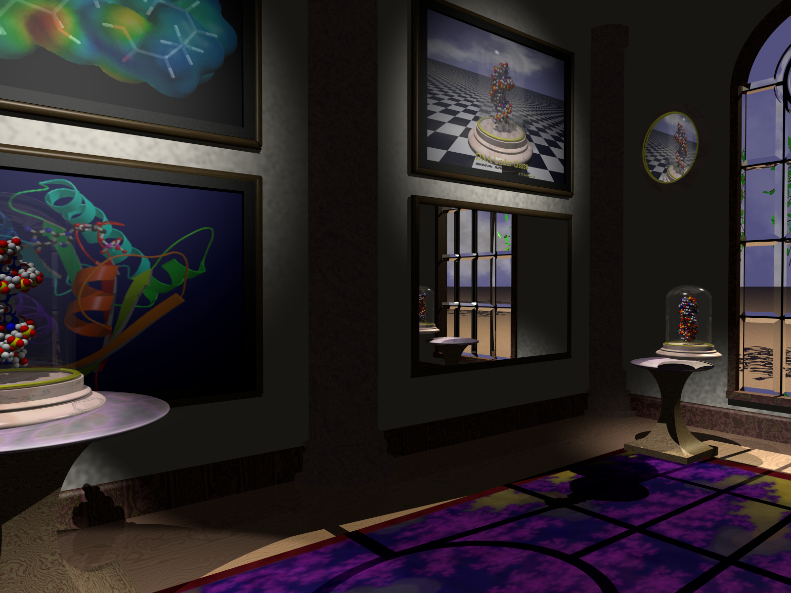

*`museum_970211.pov` — the 1997 cut, kept for provenance.*

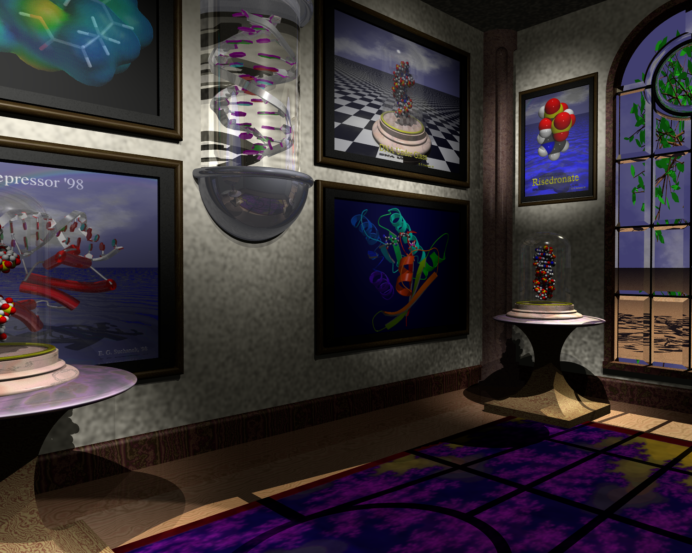

*`museum_pg.pov` — the 1999 cut, the last one. Adds the DNA cartoon mobile,
the Risedronate exhibit and a tree outside the window.*

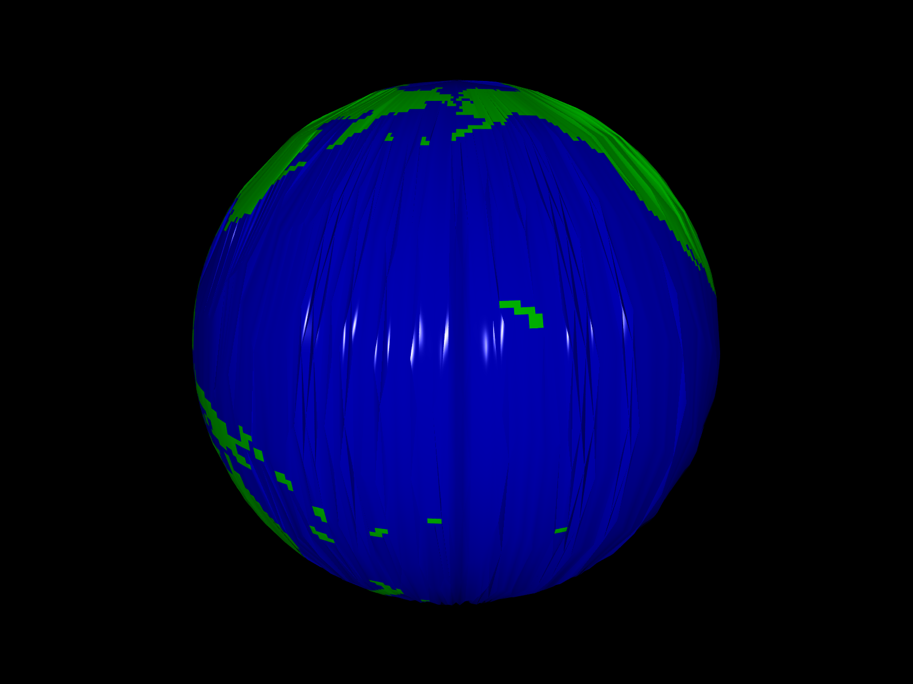

*`worldmap.pov` — the standalone world-map scene from the same tree.*

---

## Bell jar — DNA still lifes

`pov-scenes/bell_jar/` — the still lifes the museum's own pedestals were
built from: B-DNA and Z-DNA under glass, on a marble stand, over sea and sky.

*`bj.pov` — "DNA Under Glass": B-DNA under the jar, sea and sky behind.*

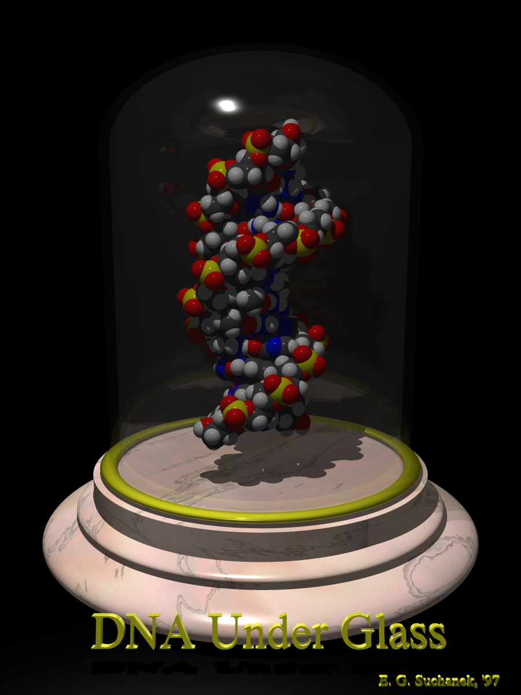

*`bj_black.pov` — the same still life on black, for print.*

*`bdna.pov` — B-DNA alone on a checkerboard, no jar.*

*`yinyang.pov` — B-DNA and Z-DNA side by side under two jars.*

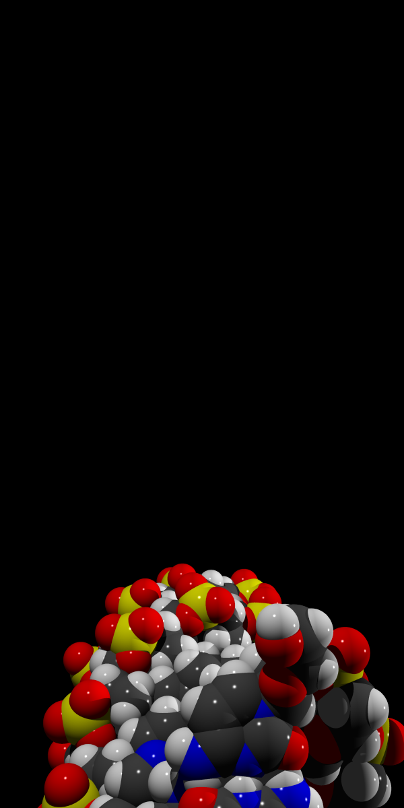

*`bdna/bdna.pov` — a second-generation variant of the still life, alongside
the turntable animation `bdna_anim.pov`.*

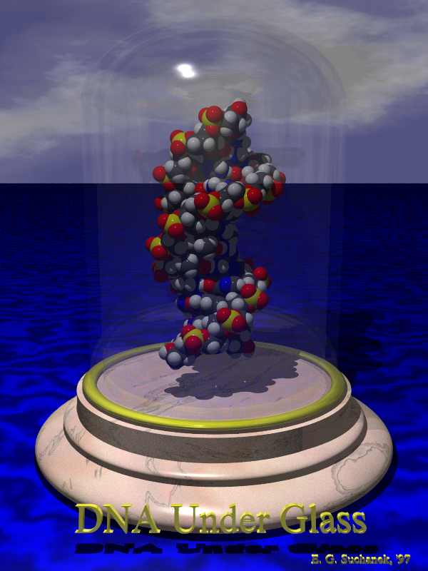

*The comparison `BJ_WALL` was chosen from, in `bell_jar/bell_jar.inc`: 0.06
(default) against 0.09 — visible but chunky, and it distorts the duplex
behind it.*

---

## Porin

`pov-scenes/porin/` — the β-barrel membrane protein, as a ribbon cartoon over
water under a rainbow.

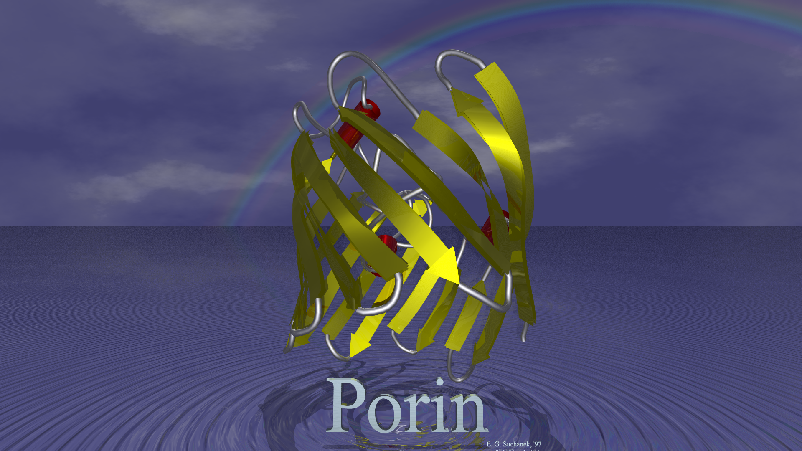

*`3porin.pov` — self-contained apart from `rainbow.inc`; the scene the
release `.ini` is written for.*

*`3porin2.pov` — a plain-background test cut of the same barrel.*

---

## Lambda repressor

`pov-scenes/lambda/` — the 1998 "Lambda Repressor" poster scene: the 1LMB PDB
file, converted to a mesh, clamped onto its operator DNA over open water.

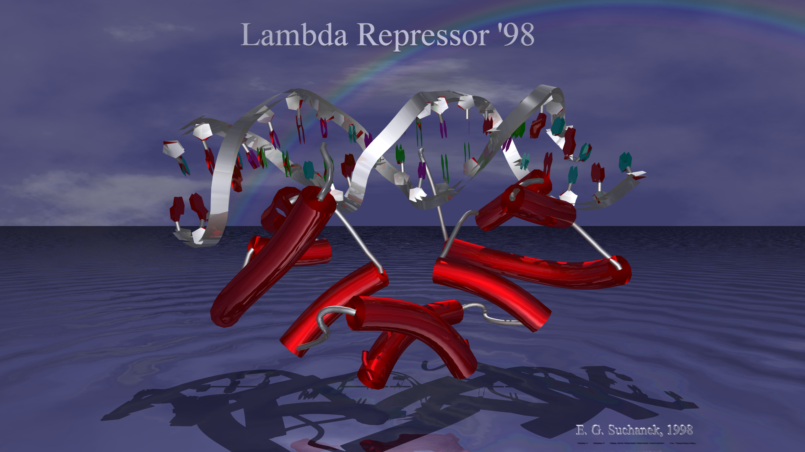

*`lambda_main.pov` — the repressor over sea and sky, with the poster's chrome
titling.*

---

## PyVista datasets

Rendered by
[`scripts/render_pyvista_hologram.py`](../scripts/render_pyvista_hologram.py)
rather than POV-Ray — candidates surveyed in
[pyvista-datasets.md](pyvista-datasets.md).

*`st-helens` — Mt. St. Helens post-eruption DEM (`examples.download_st_helens`),
terrain relief with no texture.*

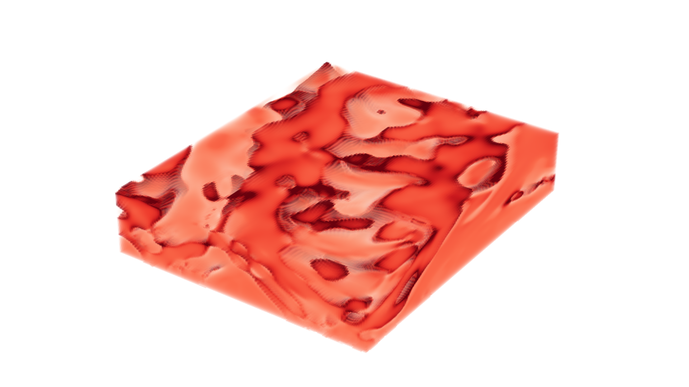

*`damavand` — Mt. Damavand volumetric data (`examples.download_damavand_volcano`),
a single conical peak.*

*`brain` — classic VTK `brain.vtk` volume, a human head MRI
(`examples.download_brain`).*

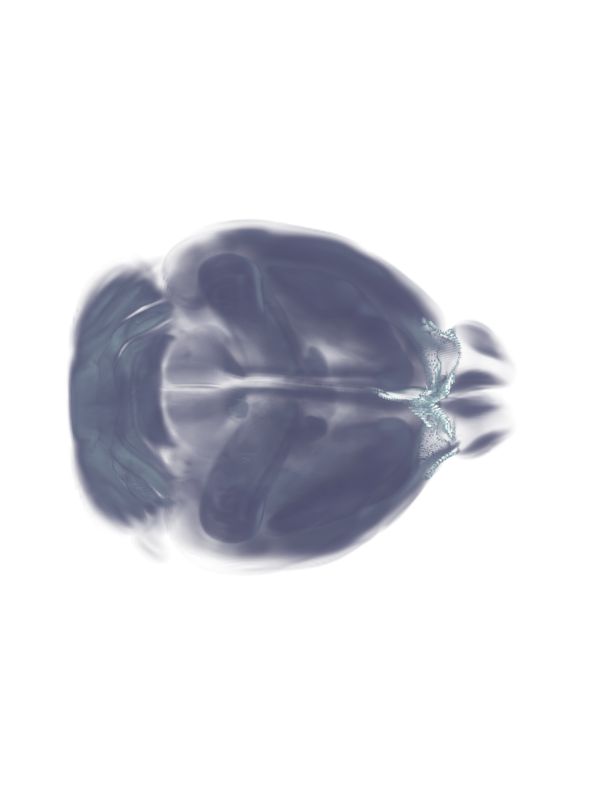

*`mouse-brain` — Allen Institute mouse brain CCFv3 average template, 50 µm
(see [pyvista-datasets.md](pyvista-datasets.md#brain-volumes) for the other
resolutions).*
