# Gallery

Every image in [`gallery/`](../gallery/), what it is, and which scene made it.
One full-quality render per scene, committed as the diffable record of what
that scene looks like. The same scenes as Looking Glass quilts are 25-40 MB
release assets rather than repo content -- see
[renders/README.md](../renders/README.md).

Regenerate any one with `make still-<name>` (`make help` lists them all), or
the whole set with `make gallery`.

**Render each at its own declared aspect.** POV-Ray maps `right` to image
width and `up` to image height whatever pixel dimensions you ask for, so a
mismatched frame stretches the picture with no warning:

| File | Scene | Aspect | Size |
|---|---|---|---|
| `museum.png` | `museum/museum.pov` | 1.778 | 1920x1080 |
| `museum_pg.png` | `museum/museum_pg.pov` | 1.25 | 1500x1200 |
| `museum_2026.png` | `museum/museum_2026.pov` | 1.778 | 1920x1080 |
| `bell_jar_bj.png` | `bell_jar/bj.pov` | 0.75 | 900x1200 |
| `bell_jar_bj_holo.png` | `bell_jar/bj_holo.pov` | 1.778 | 1920x1080 |
| `bell_jar_bj_portrait.png` | `bell_jar/bj_portrait.pov` | 0.5625 | 1080x1920 |
| `bell_jar_bdna.png` | `bell_jar/bdna.pov` | 0.75 | 900x1200 |
| `bell_jar_yinyang.png` | `bell_jar/yinyang.pov` | 1.25 | 1500x1200 |
| `porin_3porin.png` | `porin/3porin.pov` | 1.778 | 1920x1080 |
| `lambda_main.png` | `lambda/lambda_main.pov` | 1.778 | 1920x1080 |
| `vitrine_*.png` | `vitrine/exhibit_*.pov` | 1.778 | 1920x1080 |

The PyVista renders have no `right` vector to match and are rendered at the
shape their scene is composed for.

---

## Museum

`pov-scenes/museum/` -- "Eric's Science Museum," 1995-99. The room the README's
hologram is rendered from; what's on the walls is cataloged in
[about-the-image.md](about-the-image.md).

*`museum.pov` -- the canonical cut, and the one
[`render_museum_hologram.py`](../scripts/render_museum_hologram.py) drives.*

*`museum_pg.pov` -- the 1999 cut, the last one. Adds the DNA cartoon mobile,
the Risedronate exhibit and a tree outside the window.*

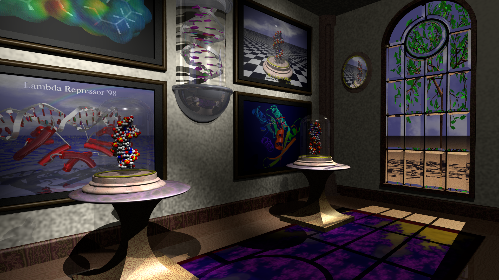

*`museum_2026.pov` -- the modern variant, composed for holographic output. The
1999 cut at 16:9 with three changes and nothing else: the oval mirror hangs
where the Risedronate picture did (the scene's own object, on a branch that
was already there), and both pedestals move inward to flank the alcove, the
left one centered under Lambda Repressor. `museum_pg.pov` is untouched.*

*`museum_970211.pov` (the 1997 cut), `museum_dark.pov` and `worldmap.pov` are
in the tree and render; none is carried here.*

---

## Bell jar -- DNA still lifes

`pov-scenes/bell_jar/` -- the still lifes the museum's own pedestals were
built from: B-DNA and Z-DNA under glass, on a marble stand, over sea and sky.

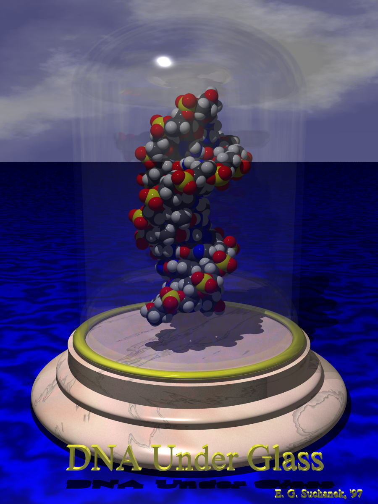

*`bj.pov` -- "DNA Under Glass": B-DNA under the jar, sea and sky behind.*

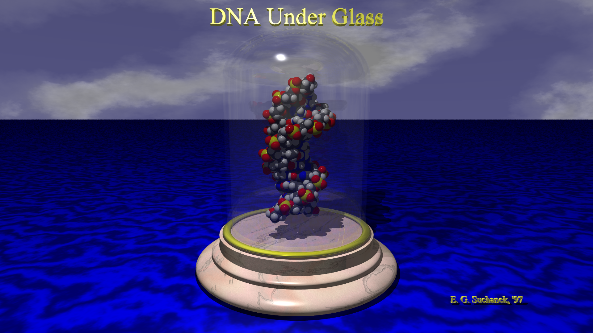

*`bj_holo.pov` -- the same still life recomposed for a Looking Glass panel:
16:9, title lifted into the sky above the dome, signature moved out over open
water at the lower right. Both sit on (or within a fraction of a pixel of) the
focal plane, where a light-field display holds them sharp; in `bj.pov` they are
camera-pinned overlays 70-74 units from the eye, in front of the scene itself.
The lens opens 53.13 -> 55.32 degrees to make room for the title, which
`bj.pov`'s framing has none of.*

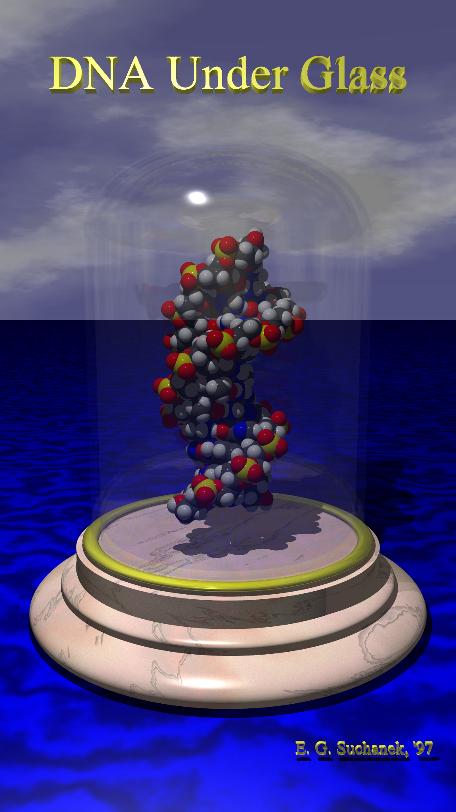

*`bj_portrait.pov` -- the 9:16 companion, for the tall panels. Same eye and the
same treatment of the lettering; the lens is set by the pedestal's width, which
is what overruns a narrow frame.*

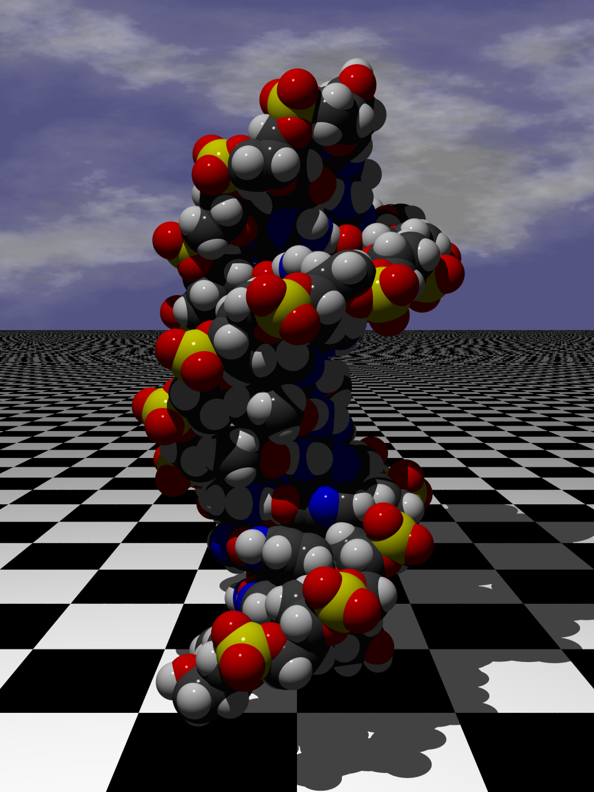

*`bdna.pov` -- B-DNA alone on a checkerboard, no jar.*

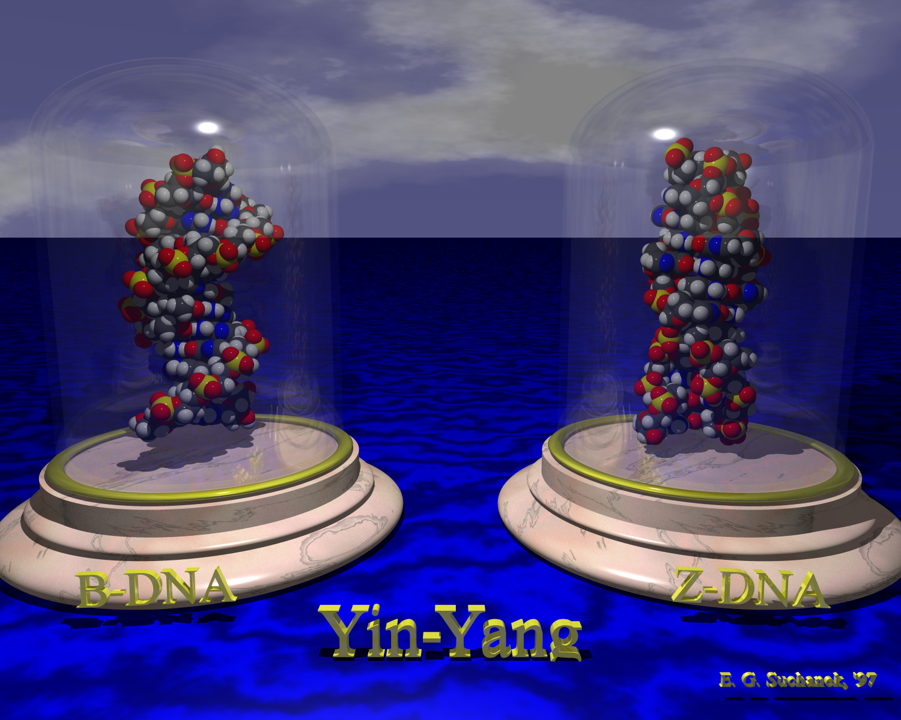

*`yinyang.pov` -- B-DNA and Z-DNA side by side under two jars.*

*`BJ_WALL = 0.06` in `bell_jar/bell_jar.inc`, the value chosen and the
default. It was picked against 0.09, which is visible but chunky and distorts
the duplex behind it; that comparison frame is no longer kept, and re-rendering
`bj.pov` with `BJ_WALL` overridden reproduces it. Setting it to 0 restores the
original zero-thickness surface, which refracts once and reads as a soap film.*

---

## Porin

`pov-scenes/porin/` -- the beta-barrel membrane protein, as a ribbon cartoon over
water under a rainbow.

*`3porin.pov` -- self-contained apart from `rainbow.inc`; the scene the
release `.ini` is written for.*

*`3porin2.pov` is in the tree but has no still: it is the stock POV-Ray
"Basic Scene Example" template with `#include "3porin.inc"` appended, and
`3porin.inc` only `#declare`s `porin` -- nothing instantiates it, so the scene
renders sky and ground and no barrel.*

---

## Lambda repressor

`pov-scenes/lambda/` -- the 1998 "Lambda Repressor" poster scene: the 1LMB PDB
file, converted to a mesh, clamped onto its operator DNA over open water.

*`lambda_main.pov` -- the repressor over sea and sky, with the poster's chrome
titling.*

---

## Vitrine -- the standard exhibit case

`pov-scenes/vitrine/` -- a museum case built in *exhibit units*: the molecule
is normalized to a unit sphere by the enclosing radius `pdb2pov` writes into
every file, and the room is built around that. These four are one set, not
four scenes. The same camera, lighting and depth budget hold a 2.5x range of
molecular radius with no per-structure tuning, which is the entire claim --
any one of them alone demonstrates nothing.

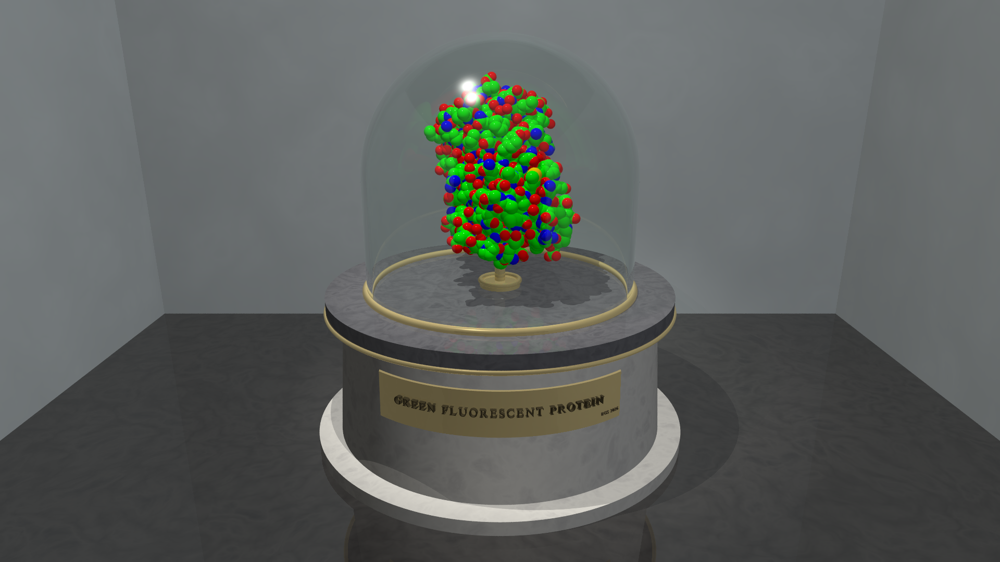

*`exhibit_gfp.pov` -- 1EMA, 1,866 atoms, enclosing radius 31.2 A. The
11-strand beta barrel, the smallest of the set.*

*`exhibit_hemoglobin.pov` -- 2HHB, 4,779 atoms, 40.3 A.*

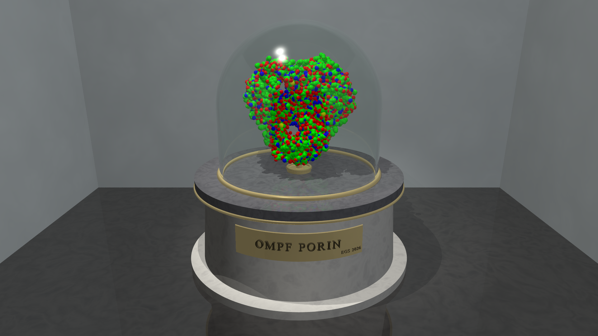

*`exhibit_ompf.pov` -- 2OMF, 8,481 atoms, 51.0 A. The trimeric porin, modern
heir to `porin/3porin.pov` above.*

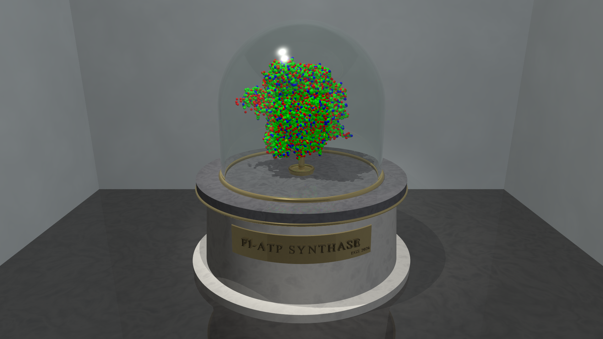

*`exhibit_f1atpase.pov` -- 1BMF, 23,481 atoms, 79.0 A. The largest, on the
same plinth at the same camera.*

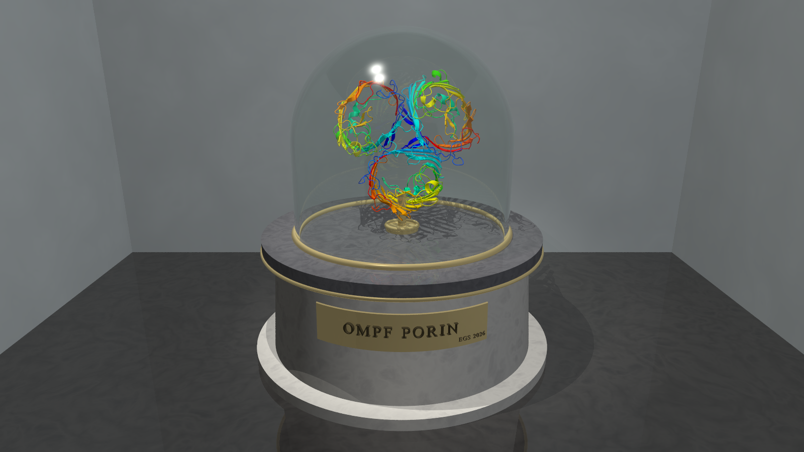

*`exhibit_ompf_cartoon.pov` -- the same porin trimer as a Richardson cartoon
rather than as atoms, via [`quiltwright.pymol`](../src/quiltwright/pymol.py).
`porin/3porin.png` above is the same subject drawn the same way in 1994, by an
exporter whose output survives in no repository; this one comes from a PDB ID
and a command line. Its geometry is generated rather than committed -- 8.9 MB
for one trimer -- so the wrapper carries the command that makes it.*

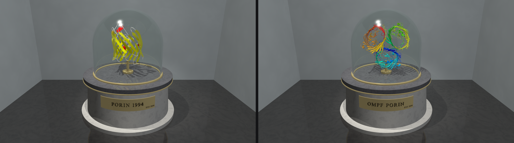

*The same subject, the same room, the same camera, thirty-two years apart.
Left: `3porin.inc`, 7,835 triangles from the lost 1994 exporter, brought onto
the `pdb2pov -o` contract by `pov-scenes/vitrine/porin_1994.inc`, which
measures and centers the original geometry without altering it. Right: 2OMF
from the RCSB, 75,792 triangles through `quiltwright.pymol`.*

*They are not quite the same molecule, which is the honest reading of the
picture: the 1994 mesh is a **monomer** -- one 16-strand barrel -- while the
modern one is assembly 1, the biological trimer. The archive image was of a
single subunit, and nothing recorded that until the two stood side by side.*

---

## PyVista datasets

Rendered by
[`scripts/render_pyvista_hologram.py`](../scripts/render_pyvista_hologram.py)
rather than POV-Ray -- candidates surveyed in
[pyvista-datasets.md](pyvista-datasets.md).

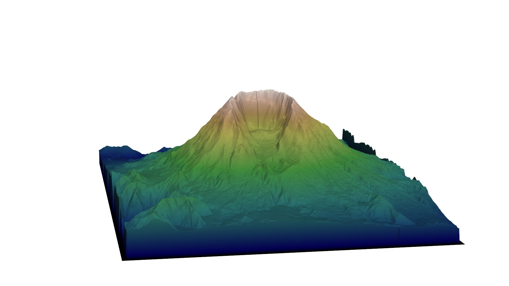

*`st-helens` -- Mt. St. Helens post-eruption DEM (`examples.download_st_helens`),
terrain relief with no texture.*

*`damavand` -- Mt. Damavand volumetric data (`examples.download_damavand_volcano`),
a single conical peak.*

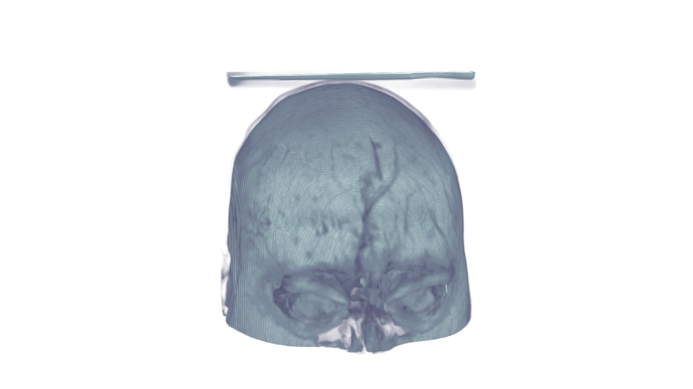

*`brain` -- classic VTK `brain.vtk` volume, a human head MRI
(`examples.download_brain`).*

*`mouse-brain` -- Allen Institute mouse brain CCFv3 average template, 50 µm
(see [pyvista-datasets.md](pyvista-datasets.md#brain-volumes) for the other
resolutions).*
