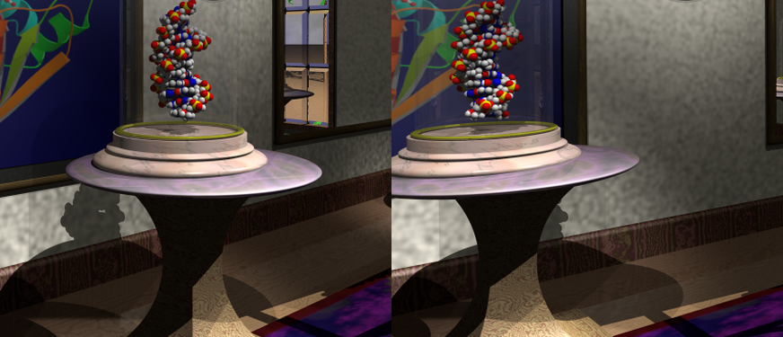

# POV-Ray Holographic Output

**Module**: `quiltwright.povray`
**Script**: `scripts/render_museum_hologram.py`
**Source**: `src/quiltwright/povray.py`

> *"The scene was finished in 1994. The display it belongs on shipped in 2023."*

Renders existing POV-Ray scenes as Looking Glass quilts, without porting the
scene to another renderer and without modifying a single line of it. Companion
to [lfd.md](lfd.md), which covers the PyVista path and the Bridge/Studio setup;
everything downstream of quilt assembly — filenames, casting, playback — is
shared. For rendering molecular structures this way, see
[pdb2pov.md](pdb2pov.md).

---

## Concept

A ray-tracer is an unusual thing to drive from a light-field pipeline, and the
reason to bother is content. Decades of POV-Ray scenes exist that were composed
for depth — interiors, still lifes, molecular sets — and they were built with
global illumination, real refraction through glass, and correct shadows. That
is exactly what a holographic display flatters, and it is expensive to
reproduce in a rasteriser.

The driver does four things:

1. Writes a **wrapper scene** per view that `#include`s the original and
   appends one `camera` statement. POV-Ray uses the *last* camera it parses,
   so this overrides the scene's camera while leaving geometry, textures and
   lighting untouched.
2. Sweeps the eye across the view cone using an **off-axis projection**
   expressed directly in POV-Ray's camera vectors.
3. Ray-traces each view at the quilt's tile resolution.
4. Hands the views to `assemble_quilt()` — the same renderer-agnostic
   assembler the PyVista path uses.

```python
from quiltwright.lfd import QUILT_PRESETS, save_quilt
from quiltwright.povray import PovCamera, render_pov_quilt

camera = PovCamera(location=(15, 20, 6), look_at=(44, 19.2, 45.1), fov=53.13)
spec = QUILT_PRESETS["16-landscape"]
quilt = render_pov_quilt("museum.pov", spec, camera, include_paths=["../myinclude"])
save_quilt(quilt, "museum", spec)      # -> museum_qs8x6a1.77778.png
```

---

## 1. The off-axis camera, in POV-Ray

This is the load-bearing trick, and POV-Ray supports it natively — which is
not obvious, because the feature is a side effect of how its camera is
specified rather than a documented capability.

POV-Ray builds the frustum from four vectors: `location` is the eye,
`direction` places the **centre of the image plane** relative to it, and
`right`/`up` **span** that plane. Critically, POV-Ray does *not*
re-orthogonalise them. Tilting `direction` while holding `right` and `up`
fixed leaves the image plane parallel to itself and shears the frustum — an
asymmetric-frustum projection, which is precisely what a light-field display
requires.

The obvious alternative — pointing each view at the subject with `look_at` —
is "toe-in". It *rotates* the camera, which introduces vertical parallax and
keystone distortion, and the display cannot fuse the result. Toe-in produces
ghosting where off-axis produces depth.

For eye offset `s` along the unit right vector `r`, focal distance `Z`, and
image-plane distance `D`:

```
location  = L + s·r
direction = D·f − (s·D/Z)·r
right     = aspect · r
up        = u
```

The subtracted term slides the image-plane centre back onto the original view
axis. Deriving it takes one line: a ray from the shifted eye through the
image-plane centre reaches the original axis at f-distance `Z` when
`s + Z·c/D = 0`, hence `c = −s·D/Z`.

Two rules follow, and both are enforced in code:

- **Never emit `angle`.** POV-Ray's `angle` keyword overrides the length of
  `direction`, which silently destroys the shear while still rendering a
  plausible-looking image. `camera_block()` computes `|direction|` explicitly
  and a test asserts the keyword never appears.
- **Get the handedness right.** POV-Ray is left-handed: `right = sky × forward`.
  Inverting it mirrors the sweep and turns the hologram inside out — near
  objects recede, far objects advance. A test pins the `+y`/`+z` → `+x` case.

POV-Ray warns `Camera vectors are not perpendicular` on every view. That
warning *is* the shear; it is expected and benign.

### Verification

A three-marker scene — spheres at depths 6, 10 and 14, focal plane at 10 —
renders with the on-plane marker pinned to the centre pixel across the whole
sweep while the others separate in opposite directions. Measured against
theory:

| Marker | Depth | Predicted shift | Measured |
|--------|-------|-----------------|----------|
| near   | 6     | −127.4 px       | −128.16 px |
| far    | 14    | +54.6 px        | +54.43 px |

Agreement is within 0.6%. `tests/test_povray.py` runs this as a live
ray-trace whenever a `povray` binary is present, asserting both the focal-plane
pin and the view ordering.

---

## 2. The depth budget

The number that decides whether a hologram fuses is the **adjacent-view
disparity**: how far a feature moves between neighbouring quilt views. The
display blends neighbours optically, so a pixel or two reads as solid depth
while larger shifts read as ghosting or a visible stack of copies. Scenes that
look fine flat routinely blow this budget.

From the off-axis projection, for content at distance `z` with focal plane at
`Z`:

```
disparity = [tan(cone/2) / tan(fov/2)] · |1 − Z/z| · tile_height / (n_views − 1)
```

The aspect ratio cancels. `view_disparity()` implements it; the ray-traced
measurements above anchor it to within 2%.

Three consequences are worth internalising:

- **Content at the focal plane has zero disparity.** It is welded to the glass.
- **A narrower FOV *increases* disparity.** This is the counterintuitive one.
  Narrowing the lens magnifies the scene and magnifies parallax with it. The
  "~14° FOV" advice that circulates for Looking Glass content is specific to
  object-centric scenes where the camera dollies in until the subject fills
  the frame. Applied to an architectural interior it makes ghosting *worse*.
  Keep the scene's own wide angle.
- **The focal plane belongs at the harmonic mean of the depth range**, not the
  midpoint. Disparity grows with `|1 − Z/z|`, which is asymmetric in depth, so
  the arithmetic midpoint leaves near content far worse off. Equalising the
  two ends gives `Z = 2/(1/near + 1/far)` — `focal_distance_for_range()`. With
  the far plane at infinity it reduces to `2 × near`.

Roughly 4–5 px is the practical ceiling; past ~8 px expect visible ghosting on
hard edges.

---

## 3. Sweep clearance — the constraint peculiar to interiors

The quilt sweeps the eye laterally by `Z · tan(cone/2)`. For an object on a
turntable that distance is empty space. **Inside a room it is furniture and
walls.**

At a 35° cone with the museum's focal plane, the sweep is ±15.3 units. The
room's usable lateral corridor, measured by rendering at candidate offsets and
watching for the frame to collapse to the unlit back face of a wall, is only
−18 to +8. The first full render of this scene therefore had **11 of its 48
views showing the outside of a wall** — and the failure is quiet, because the
centre view (the one you preview) is perfect.

The fix is to probe the corridor, recentre the eye within it, and derive the
cone from the clearance that remains:

```
cone = 2 · atan((corridor_half_width − margin) / focal_distance)
```

`Clearance` holds the measured corridor and does all three:

```python
from dataclasses import replace

from quiltwright.lfd import QUILT_PRESETS, focal_distance_for_range
from quiltwright.povray import Clearance, PovCamera, format_depth_budget

room = Clearance(left=-18.0, right=8.0, margin=2.0)   # measured, in scene units
camera = PovCamera.aimed(
    (15.0, 20.0, 6.0), (58.0, 19.0, 53.0),   # the scene's own eye and aim
    fov=53.13,                               # the scene's own lens
    focal_distance=focal_distance_for_range(32.0, 100.0),
    lateral_shift=room.centre,               # -5: middle of the corridor
)
spec = replace(QUILT_PRESETS["16-landscape"], view_cone=room.cone(camera.focal_distance))
```

For the museum that gives 25.6°, comfortably inside both the 16" Landscape's
50° native cone and the documented 35° standard. `format_depth_budget(...,
clearance=room)` prints the sweep extent against the measured walls and warns
when it exceeds them — print it before committing to the render, since this is
the failure that costs an hour of ray-tracing to discover.

Worth noting: narrowing the cone to fit costs less than it appears. With the
focal plane at the harmonic mean, the disparity at the depth extremes depends
on the *physical baseline* and the scene's depth range, not on where the focal
plane sits — so trading cone for clearance trades look-around, not sharpness.

---

## 4. Case study — the meek museum

A 1994 Michael Mittelstadt interior, later extended with molecular exhibits
under bell jars. Near-ideal light-field content: a foreground pedestal,
mid-depth framed art, and an arched window onto terrain and sky at infinity.

**Measured scene properties** (plane-sweep probe along the view axis):

| Property | Value |
|----------|-------|
| Nearest geometry | ~32 units |
| Structured far content | ~100 units |
| Sky through window | effective infinity (~10% of frame) |
| Lateral corridor | −18 to +8 units |
| Scene's own vertical FOV | 53.13° |

**Derived camera:**

| Parameter | Value | Source |
|-----------|-------|--------|
| Focal plane | 48.5 units | harmonic mean of 32 and 100 |
| Eye shift | −5 units along `r` | centres the lateral corridor |
| View cone | 25.6° | clearance-limited, 2-unit margin |
| FOV | 53.13° | the scene's own lens, unchanged |

**Resulting depth budget** (16" Landscape, 960×720 tiles, 48 views):

| Content | Depth | Adjacent-view disparity |
|---------|-------|-------------------------|
| Nearest geometry | 32 | 3.58 px |
| Focal plane | 48.5 | 0.00 px |
| Far interior | 100 | 3.58 px |
| Sky | ∞ | 6.95 px (soft, low contrast) |


*Centre view (view 24) of the finished quilt, 960×720.*

**Verification on the finished quilt.** Near and far features must shift in
*opposite* directions about a stationary focal plane — the signature of a
correct off-axis render. Measured over a 12-view baseline:

| Feature | Measured | Predicted |
|---------|----------|-----------|
| Pedestal rim (near) | +42 px | +36 px |
| Bell-jar molecule (near) | +37 px | +36 px |
| Window and tree (far) | −21 px | −36 px |

All 48 tiles are populated, with a brightness spread of 4.0 across the sweep —
no collapsed views.



*Extreme views (0 and 47) of the same crop. The pedestal traverses most of its
own width against the painting behind it.*

**Cost:** 7.7 s per view, 368 s for the full 7680×4320 quilt, on an M-series
Mac at `+A0.05 +AM2 +R4 +Q11`. Quilts repay harder anti-aliasing than stills:
each view aliases differently and the display interpolates between them, so
edge noise reads as shimmer rather than grain.

```bash
python scripts/render_museum_hologram.py                 # full quality
python scripts/render_museum_hologram.py --preview       # quarter size, ~40 s
python scripts/render_museum_hologram.py --cast          # straight to the display
```

---

## 5. API

### `PovCamera`

| Field | Meaning |
|-------|---------|
| `location` | Eye position in scene units |
| `look_at` | Aim point — **becomes the focal plane**, so it lands on the glass |
| `sky` | Up-hint for the camera basis (default `(0,1,0)`) |
| `fov` | *Vertical* field of view in degrees |

Methods: `focal_distance`, `basis()` → `(forward, right, up)`,
`image_plane_distance()`.

`PovCamera.aimed(location, aim, *, fov, focal_distance=None, lateral_shift=0.0,
sky=(0,1,0))` adopts a scene's own viewpoint and adapts it for a sweep: the
focal plane moves to `focal_distance` along the original aim ray, and the eye
slides `lateral_shift` along the right vector with the look-at point riding
along, so the view **direction** and lens stay exactly as the scene's author
composed them.

### `Clearance(left, right, margin=0.0)`

The measured lateral corridor of an enclosed scene, in scene units along the
camera's right vector.

| Member | Meaning |
|--------|---------|
| `centre` | Offset that puts the eye in the middle of the corridor — feed to `lateral_shift` |
| `half_width` | Usable travel either side of `centre`, net of `margin` |
| `cone(focal_distance)` | Widest view cone whose outermost eye still clears the walls |
| `fits(spec, focal_distance)` | Whether the sweep `spec` asks for stays inside the corridor |

### Reporting

- `sweep_extent(spec, focal_distance)` — half-width of the lateral eye travel
  the sweep needs, i.e. the largest `view_offsets()` magnitude in closed form.
- `depth_budget(spec, camera, depths)` — `(label, depth, disparity_px)` per
  labelled depth; `math.inf` is accepted for sky.
- `format_depth_budget(spec, camera, depths, *, clearance=None, soft_px=5.5)` —
  the same as a printable report, flagging depths above `soft_px` and warning
  when the sweep leaves `clearance`.

### `render_pov_quilt(scene, spec, camera, ...)`

| Argument | Purpose |
|----------|---------|
| `include_paths` | Extra `#include` search directories. The scene's own directory is always searched. |
| `view_cone` | Override the spec's cone in degrees |
| `antialias` | POV-Ray `+A` threshold; lower is better. `None` disables |
| `quality` | POV-Ray `+Q` level, 0–11 |
| `jobs` | Concurrent POV-Ray processes (see below) |
| `binary` | Executable path; also settable via `POVRAY_BINARY` |
| `extra_args` | Raw POV-Ray flags, e.g. radiosity cache options |
| `keep_views` | Directory to retain per-view PNGs and wrapper scenes for inspection |

Returns a `uint8` RGB array; pair with `save_quilt()` and `cast_quilt()` from
[`quiltwright.lfd`](lfd.md).

### Supporting helpers in `quiltwright.lfd`

- `assemble_quilt(views, spec)` — renderer-agnostic tiling; consumes views
  lazily and validates the count.
- `view_disparity(spec, fov, focal_distance, depth)` — adjacent-view shift in px.
- `focal_distance_for_range(near, far)` — harmonic-mean focal distance.

---

## 6. Gotchas

**Legacy scenes need library paths.** Scenes from the 1990s reference includes
by bare filename. POV-Ray searches its working directory and the `+L` library
paths, *not* the included file's directory, so pass `include_paths` for any
shared include tree. Missing includes fail with `Cannot open include file` and
a line number in the wrapper, not the scene.

**`.ini` files carry intended quality settings.** Many scenes ship one. Command
line options override ini values, so `extra_args=["museum.ini"]` composes.

**Radiosity and photons should be cached, not recomputed.** Lighting is
identical across a view sweep, so recomputing it 48 times is pure waste. Render
one view with the cache saved and the rest with it loaded, via `extra_args`.
The museum uses neither, which is why it renders as fast as it does.

**`jobs` is usually best left at 1.** POV-Ray already threads a single render
across all cores. Raise it only when per-render startup dominates — very small
tiles or preview passes.

**RGBD quilts are not a shortcut here.** Bridge supports them and `cast_quilt`
carries the `isRGBD` flag, but POV-Ray 3.7 has no native depth output and
faking one requires overriding every object's texture — invasive and
unreliable on a complex scene. Render the views.

**Preview at quarter size.** Disparity scales with tile height, so a preview
quilt genuinely has lower disparity than the final — the composition and view
validity transfer, the ghosting margin does not.
