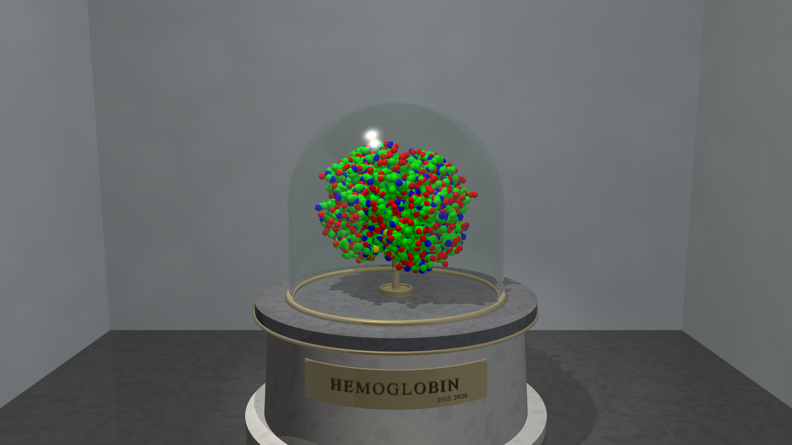

# The vitrine -- a standard exhibit case for molecules

The archive's molecules stand against an infinite sky. This puts one in a
gallery: a stone plinth in a shallow alcove, under a bell jar, lit like an
exhibit, with a brass plaque.



It exists because a room is a better holographic subject than a sky. An object
on an empty backdrop gives the display two depths -- the object, and nothing.
An alcove gives it a floor with a reflection in it, a plinth, a jar with two
glass surfaces, a cast shadow and a back wall, all inside a depth range that
still fits the budget.

---

## What makes it standard

**Exhibit units.** The molecule is normalised to a unit sphere using the
enclosing radius `pdb2pov` writes into every scene it produces, and the room is
built around that. So the camera, the lighting and the depth budget are the
same for every structure, whatever its size:

| Exhibit | PDB | atoms | enclosing R | camera | near / far | cone |
|---|---|---|---|---|---|---|
| `gfp` | 1EMA | 1,866 | 31.2 A | identical | identical | identical |
| `hemoglobin` | 2HHB | 4,779 | 40.3 A | identical | identical | identical |
| `ompf` | 2OMF | 8,481 | 51.0 A | identical | identical | identical |
| `f1atpase` | 1BMF | 23,481 | 79.0 A | identical | identical | identical |

A 2.5x range of molecular radius, one setup, no per-structure tuning. That is
the whole claim, and it is the reason `scripts/render_vitrine.py` contains no
per-molecule numbers, where `render_museum_hologram.py` needs a measured
corridor, a measured depth range and a derived cone specific to that room.

**The jar is derived, not tuned.** `Vitrine_Case()` builds a hemisphere of
radius `VIT_FILL * VIT_JAR_GAP` centred on the molecule, on a tube down to the
plinth. It is a concentric shell, so it cannot clip a structure the enclosing
sphere describes correctly.

**Clearance by construction.** The alcove is open toward -z and its side walls
stand at `+-VIT_SIDE` with the eye at `z = -VIT_CAM_D`. The lateral corridor is
therefore known before anything is rendered, rather than probed for afterwards.
Measured on the 16" Landscape preset at quarter scale:

```
  focal plane      8.4 units
  view cone        50.0 deg over 48 views
  eye sweep        +/-3.9 units (clearance +/-4.8 after 0.5 margin)
  adjacent-view disparity:
    near                    6.6   3.04 px
    far                    11.4   3.04 px
  widest legal cone: 59.6 deg
```

Balanced disparity at both extremes, well under the 5.5 px soft limit, and the
display's **full native 50 degree cone** fits with 9.6 degrees to spare. The
museum, by comparison, is clearance-limited to 26.4 degrees. Brightness across
all 48 rendered tiles spreads by 2.0 grey levels out of 255, against the
museum's 7.3: no view collapses to the back of a wall.

---

## Using it

```sh
# 1. Get the structure and convert it, naming the output for the molecule
#    rather than the PDB ID.
curl -O https://files.rcsb.org/download/2hhb-assembly1.cif.gz
pypdb2pov 2hhb-assembly1.cif.gz hemoglobin -o -v

# 2. Write a four-line wrapper (copy exhibit_hemoglobin.pov).

# 3. Still, at the vitrine's own 16:9.
povray +Iexhibit_hemoglobin.pov +W1920 +H1080 +Q11 +A0.15 \
       -L"$(pypdb2pov --include-dir)"

# 4. Hologram.
python ../../scripts/render_vitrine.py hemoglobin --preview
python ../../scripts/render_vitrine.py hemoglobin --cast
```

Name the output for the molecule, not the PDB ID. `pypdb2pov` derives the POV
identifier from the *output stem*, and a stem beginning with a digit gets a
leading underscore (`_2hhb`) -- legal, but easy to get wrong by hand. The
library API does not sanitise at all: `SceneOptions(name="2hhb")` emits
`#declare 2hhb_obj = ...`, which POV-Ray rejects outright.

Keep `+Q` at 8 or above. Below it POV-Ray disables refraction, and the bell jar
renders as a solid dome.

---

## Parameters

Set any of these before `#include "vitrine.inc"`.

| Parameter | Default | Effect |
|---|---|---|
| `VIT_LABEL` | `""` | Plaque text; empty means no plaque. Type size auto-fits the brass |
| `VIT_SIGN` | 1 | Maker's mark, lower right of the plaque. 0 leaves the plate unsigned |
| `VIT_SIGN_TEXT` | `"EGS 2026"` | What the mark says |
| `VIT_FILL` | 1.12 | Molecule size in exhibit units. The enclosing sphere circumscribes, so elongated structures read small here -- raise it for those |
| `VIT_JAR` | 1 | 0 gives an open plinth with no glass |
| `VIT_JAR_GAP` | 1.22 | Shell radius as a multiple of `VIT_FILL` |
| `VIT_POST` | 1 | Brass mount pin. 0 lets the molecule levitate |
| `VIT_MOL_Y` | -0.22 | Seat height |
| `VIT_SIDE` | 5.30 | Alcove half-width, and therefore the sweep corridor |
| `VIT_BACK` | 3.40 | Back wall; this sets the far depth |
| `VIT_CAM_D` / `VIT_CAM_Y` / `VIT_AIM_Y` | 8.00 / 0.78 / -0.42 | Eye and aim |
| `VIT_FOV_V` / `VIT_ASPECT` | 38.5 / 16:9 | Lens and frame |
| `VIT_WALL_HUE` | `<0.30,0.33,0.34>` | Gallery wall colour |
| `VIT_KEY` | 1.00 | Overall light level |
| `VIT_SOFT` | 0 | Area key light: soft shadows, much slower |

Both the label and the signature go through `Vitrine_Wrapped_Text(Str, Sc,
Rad, Yd, ACtr, Dp)`, which lays a string round a cylinder one glyph at a time,
measuring each with `max_extent()` so the spacing stays proportional on the
curve. It emits untextured objects, so a caller wraps it in a `union` and
textures that -- useful for anything else that has to read off a curved
surface.

`Vitrine_Report()` prints the eye, aim, lens, near, far, jar radius, clearance
and widest legal cone at parse time, so the numbers `render_vitrine.py` uses
come out of the scene rather than being guessed at the Python end. If the two
drift apart, the render log says so.

## Files

| File | What |
|---|---|
| `vitrine.inc` | The case: parameters, textures, `Vitrine_Mount/Case/Plinth/Room/Lights/Camera/Report` |
| `exhibit_*.pov` | Four-line wrappers, one per exhibit |
| `*.inc` | `pypdb2pov -o -v` output, van der Waals spheres |

Textures are defined inline rather than pulled from `marble2.inc`, whose
POV-1.0 dither warns on every render and cannot be modernised pixel-exactly.
The glass has a real `interior` with `ior 1.52`, so unlike the 1993 bell jar it
refracts twice and reads as glass rather than as a soap film.

Ball-and-stick (`pypdb2pov -b -d 1.9`) works too, but at exhibit scale it reads
as confetti. Space-filling is the museum representation.
